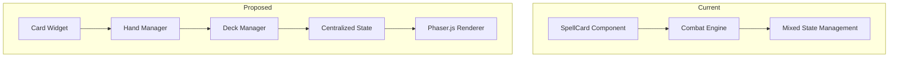
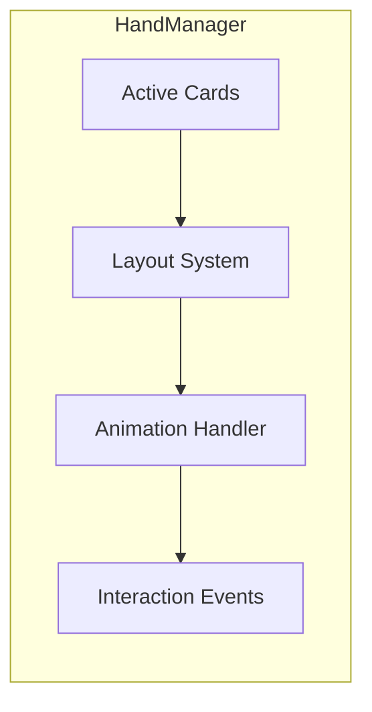
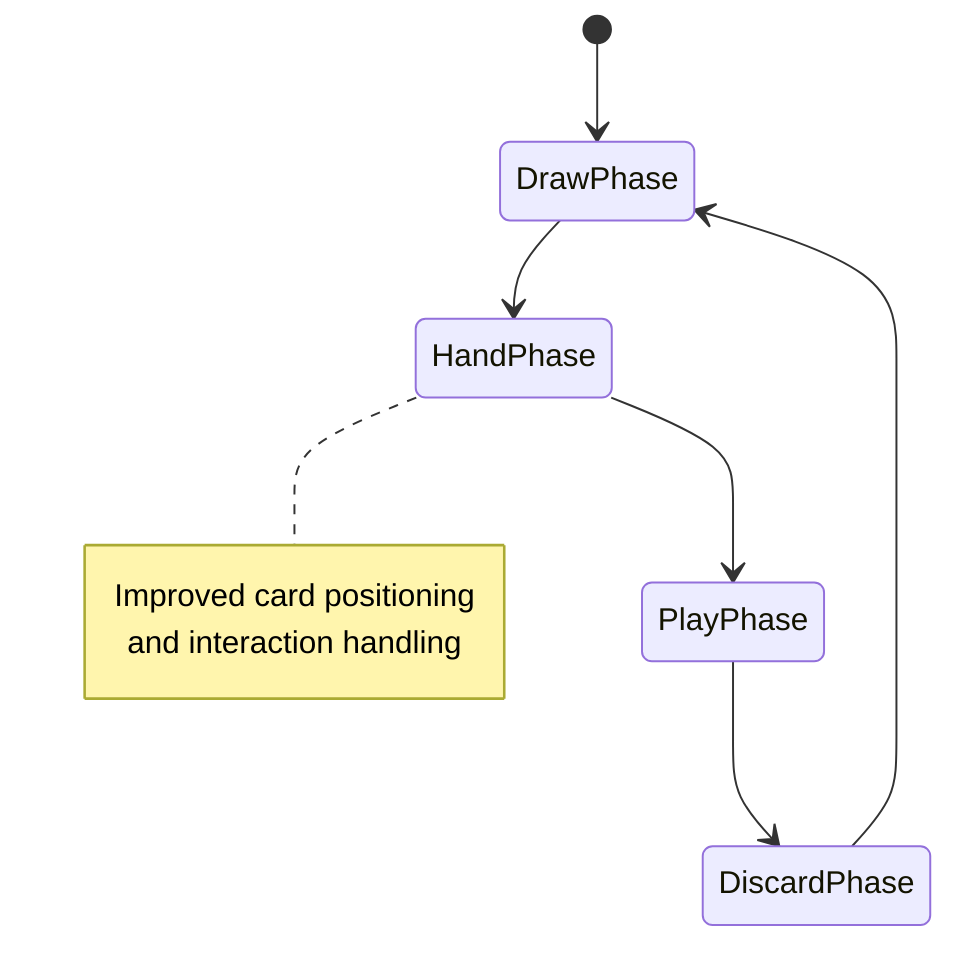
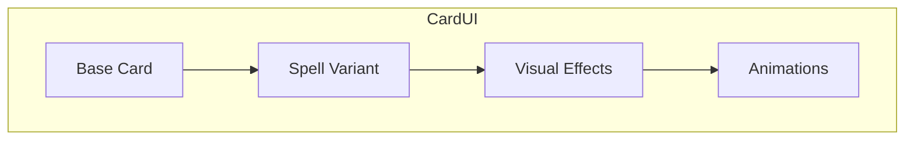

# Wizard's Choice Refactor Proposal
Implementing robust patterns for card-based mechanics using Phaser.js

## Current vs Proposed Structure

### Card Management & Rendering



## Key Improvements

### 1. Widget-Based Card System
A dedicated widget system for spell cards using Phaser.js provides better encapsulation and state management:

```typescript
interface SpellCardWidget {
    sprite: Phaser.GameObjects.Sprite;
    particles?: Phaser.GameObjects.Particles.ParticleEmitter;
    state: {
        isFlipped: boolean;
        zIndex: number;
        position: Vector2;
    };
    
    // Core methods
    flip(): void;
    setPosition(pos: Vector2): void;
    updateVisuals(): void;
    updateParticleEffects(): void;
}
```

### 2. Hand Management
A dedicated hand management system handles card organization and interactions:



### 3. Deck Organization
A structured deck management system improves card flow and game state:

```typescript
class SpellDeck {
    private drawPile: Spell[];
    private discardPile: Spell[];
    
    drawCard(): Spell;
    shuffleDiscard(): void;
    addToDiscard(spell: Spell): void;
}
```

## Implementation Priority

1. **Card Component Refactor**
   - Convert SpellCard to widget-based system
   - Implement proper state management
   - Add animation support

2. **Hand Management**
   - Create dedicated hand manager
   - Implement card positioning
   - Add drag-and-drop support

3. **Deck System**
   - Centralize deck management
   - Implement proper shuffle mechanics
   - Add discard pile handling

## State Flow



## Code Examples

### Current Combat Engine
```typescript
// Current implementation with mixed concerns
export function drawCards(state: CombatState, isPlayer: boolean, count: number) {
    // Mixed concerns and complex state management
}
```

### Proposed Refactor
```typescript
// Structured approach with clear separation of concerns
class SpellManager {
    private handManager: HandManager;
    private deckManager: DeckManager;

    drawCards(count: number): void {
        const cards = this.deckManager.draw(count);
        this.handManager.addCards(cards);
    }

    playCard(card: Spell): void {
        this.handManager.removeCard(card);
        this.deckManager.addToDiscard(card);
    }
}
```

## UI Improvements



## Migration Steps

### Phase 1: Card Components
1. Create SpellCardWidget base class
2. Migrate existing SpellCard functionality
3. Implement proper state handling

### Phase 2: Hand Management
1. Create HandManager class
2. Implement card positioning logic
3. Add interaction handling

### Phase 3: Deck System
1. Create DeckManager class
2. Implement draw/discard mechanics
3. Add shuffle functionality

## Technical Implementation

### Visual Effects System
```typescript
class SpellCardWidget extends BaseWidget {
    private sprite: Phaser.GameObjects.Sprite;
    private particles?: Phaser.GameObjects.Particles.ParticleEmitter;
    
    render() {
        this.update2DElements();
        if (this.hasSpecialEffect) {
            this.updateParticleEffects();
        }
    }

    private updateParticleEffects() {
        // Dynamic particle effects for spells
        this.particles.setPosition(this.x, this.y);
        this.particles.setSpeed(200);
        this.particles.setBlendMode(Phaser.BlendModes.ADD);
    }
}
```

### Performance Optimizations
- Utilize Phaser.js's optimized 2D rendering pipeline
- Implement sprite atlases for efficient texture management
- Use particle systems for dynamic spell effects
- Leverage Phaser.js's animation system for smooth transitions
- Implement device-based quality settings for optimal performance

## Core Systems Integration
- Card Widget System with Phaser.js sprites
- Hand Management with optimized 2D positioning
- Deck Organization maintains current structure
- Enhanced visual feedback through particle effects
- Smooth animations for card movements

## Technical Benefits

1. **Improved Organization**
   - Clear separation of concerns
   - Better state management
   - Modular components
   - Optimized 2D rendering pipeline

2. **Enhanced Maintainability**
   - Isolated card logic
   - Cleaner combat engine
   - Easier debugging
   - Consistent rendering approach

3. **Better User Experience**
   - Smooth particle-based spell effects
   - Responsive interactions
   - Consistent behavior
   - Efficient animation system

## Notes
- Maintain spell-specific features and effects
- Focus on improving core card mechanics
- Preserve existing game rules and balance
- Retain combat system uniqueness
    - Implement creature spell cards that:
        - Provide automatic attack/defense capabilities
        - Use power value for attack damage
        - Use toughness for damage absorption before player takes damage
        - Reset toughness/health at turn end if not destroyed
        - Die when taking toughness value in damage during one turn before turn ends
        - Cost an amount of mana to cast/summon and an equal amount to maintain each turn. Amount equal to half the creature's total power+toughness+1 rounded up to nearest whole number. 
