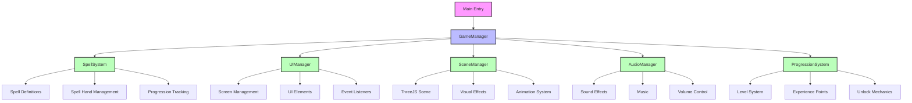
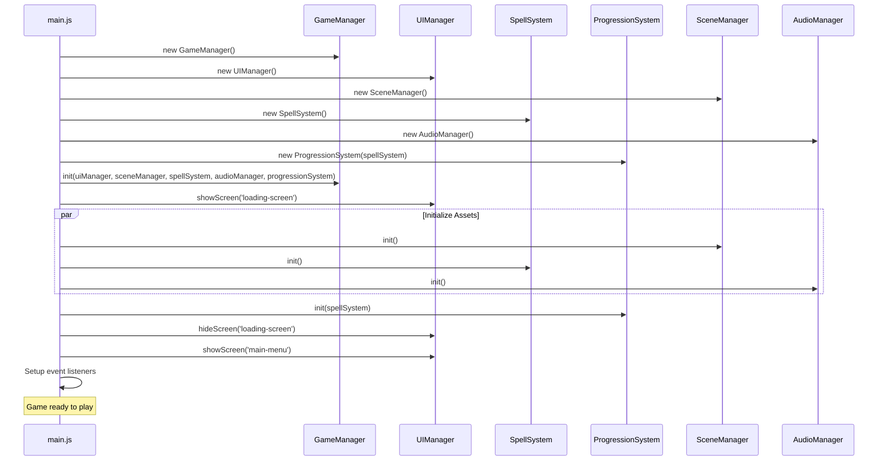
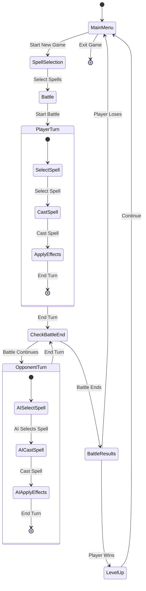
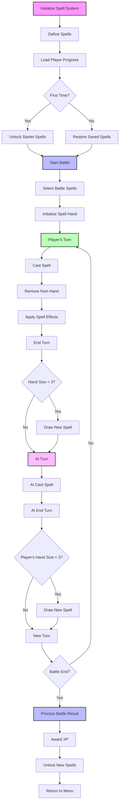
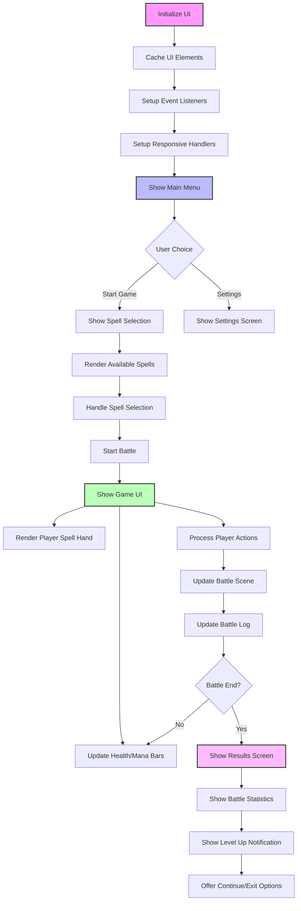
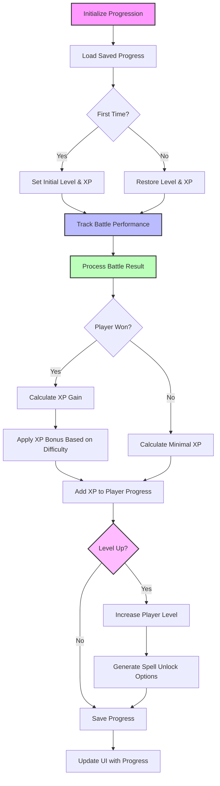
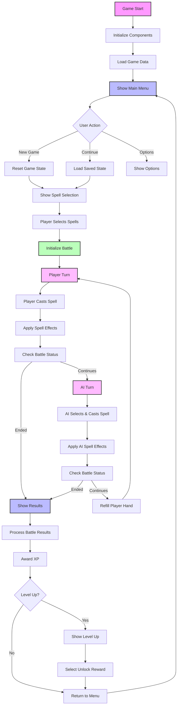

# Wizard's Choice - Process Maps

This document contains process maps for the Wizard's Choice game, visualizing the main components, interactions, and game flow.

## Component Structure

## Game Initialization Process

## Game Loop Process

## Spell System Process

## UI System Process

## Progression System Process

## Integrated Game Flow

## Potential Refactoring Targets

```mermaid
graph TD
    A[Duplicate Code] --> B[src/game/* vs src/js/*]
    A --> C[Redundant Logic in GameManager]
    A --> D[Overlapping UI Management]
    
    E[Code Bloat] --> F[EnhancedSpellSystem.js - 964 lines]
    E --> G[GameManager.js - 1440 lines]
    E --> H[EnhancedUIManager.js - 886 lines]
    
    I[Disconnected Components] --> J[Unused Files in src/js]
    I --> K[Duplicate HTML Structure]
    
    L[Refactoring Opportunities] --> M[Split EnhancedSpellSystem]
    L --> N[Modularize GameManager]
    L --> O[Consolidate UI Logic]
    
    style A fill:#f99,stroke:#333,stroke-width:2px
    style E fill:#f99,stroke:#333,stroke-width:2px
    style I fill:#f99,stroke:#333,stroke-width:2px
    style L fill:#9f9,stroke:#333,stroke-width:2px
```

