# Process Maps

## Wizard's Study UI Layout

```mermaid
flowchart TD
    WS[Wizard's Study] --> Header[Header Section]
    WS --> MainArea[Main Content Area]
    WS --> Sidebar[Sidebar]
    
    Header --> Title[Title]
    Header --> PlayerInfo[Player Info]
    
    PlayerInfo --> PlayerName[Player Name]
    PlayerInfo --> PlayerLevel[Player Level]
    PlayerInfo --> ProfileButton[Profile Button]
    
    MainArea --> StudyScene[Study Scene]
    MainArea --> Actions[Action Buttons]
    
    StudyScene --> Background[Background]
    Background --> CustomizeBtn[Customize Background Button]
    
    Actions --> PrimaryActions[Primary Actions]
    Actions --> ActionGroups[Action Groups]
    Actions --> SecondaryActions[Secondary Actions]
    
    PrimaryActions --> StartDuel[Start Next Duel]
    
    ActionGroups --> DeckBuilder[Deck Builder]
    ActionGroups --> Equipment[Equipment]
    ActionGroups --> Spellbook[Spellbook]
    
    SecondaryActions --> PotionCrafting[Potion Crafting]
    SecondaryActions --> Marketplace[Marketplace]
    
    Sidebar --> Stats[Wizard Stats]
    Sidebar --> Equipped[Equipped Items]
    Sidebar --> Spells[Equipped Spells]
    Sidebar --> Ingredients[Ingredients]
    
    Stats --> Health[Health]
    Stats --> Mana[Mana]
    Stats --> ManaRegen[Mana Regen]
    Stats --> Experience[Experience]
    Stats --> LevelUpPoints[Level-up Points]
    Stats --> Gold[Gold]
    
    Equipped --> EquipmentSlots[Equipment Slots]
    Spells --> SpellList[Spell List]
    Ingredients --> IngredientCount[Ingredient Count]
```

## Battle System Workflow

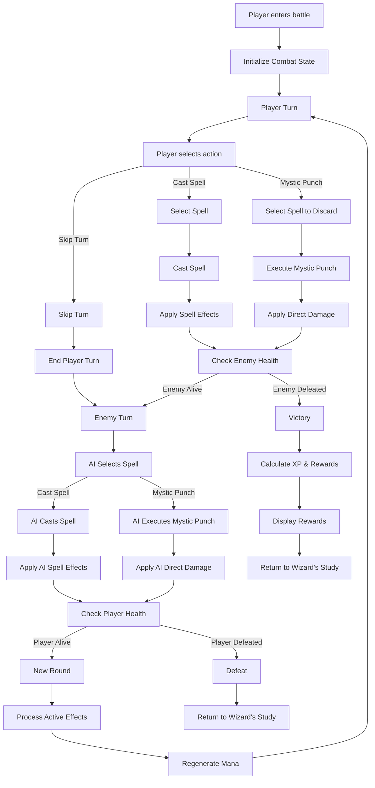

## Battle Consumable Flow

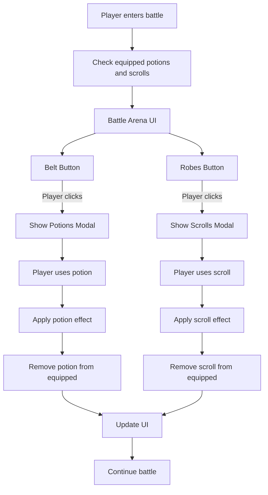

## Equipment System

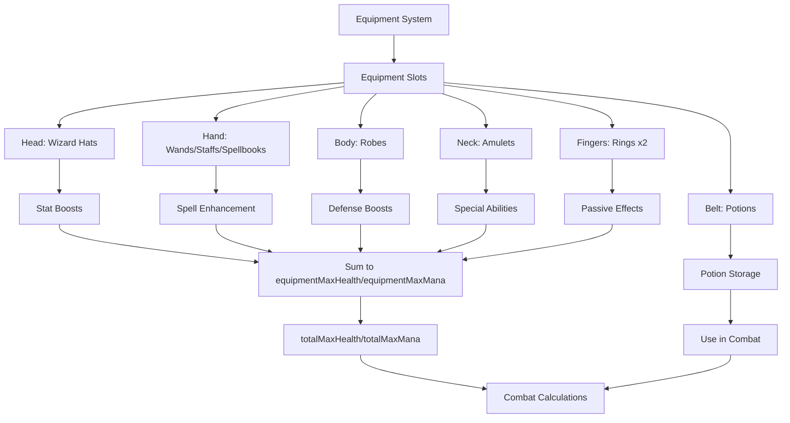

## Potion System

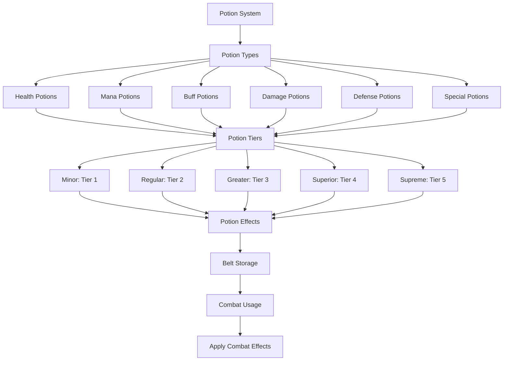

## Potion Crafting System

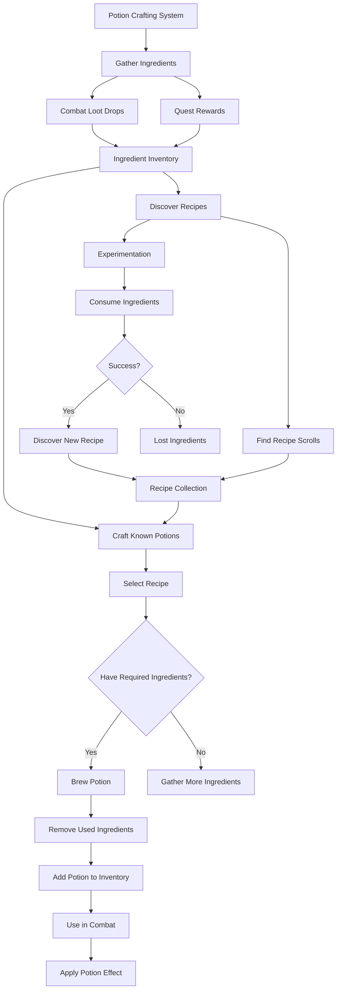

## 3D Battle Screen Components

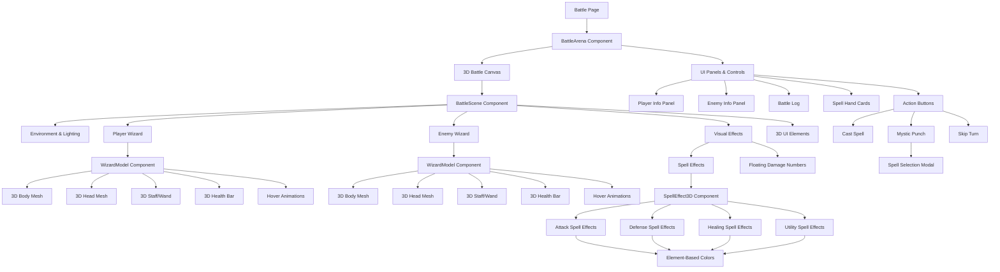

## Spell Scroll System

```mermaid
flowchart TD
    Start[Spell Scroll System] --> Acquisition[Scroll Acquisition]
    Acquisition --> Loot[Combat Loot Drops]
    Acquisition --> Purchase[Market Purchases]
    
    Loot --> ScrollInventory[Scroll Inventory]
    Purchase --> ScrollInventory
    
    ScrollInventory --> Usage[Scroll Usage]
    
    Usage --> WizardStudy[Use in Wizard's Study]
    Usage --> BattleUse[Use in Battle]
    
    WizardStudy --> LearnSpell[Learn Spell Permanently]
    LearnSpell --> RemoveScroll1[Remove Scroll from Inventory\n(Use updateWizardInSaveSlot for save slot consistency)]
    LearnSpell --> AddSpell[Add Spell to Wizard's Collection]
    
    BattleUse --> CastWithoutMana[Cast Without Mana Cost]
    CastWithoutMana --> ApplySpellEffect[Apply Spell Effect]
    CastWithoutMana --> RemoveScroll2[Remove Scroll from Inventory\n(Use updateWizardInSaveSlot for save slot consistency)]
    
    ScrollInventory --> ScrollUI[Scroll UI Interfaces]
    ScrollUI --> StudyInterface[Wizard's Study Interface]
    ScrollUI --> BattleInterface[Battle Interface]
    
    StudyInterface --> ScrollPreview[Scroll/Spell Preview]
    StudyInterface --> LearnButton[Learn Spell Button]
    
    BattleInterface --> ScrollsButton[Use Scroll Button]
    BattleInterface --> ScrollSelection[Scroll Selection Grid]
    ScrollSelection --> SpellEffect[Immediate Spell Effect]
```

## Market System

```mermaid
flowchart TD
    Start[Market System] --> Locations[Market Locations]
    Locations --> NoviceBazaar[Novice Bazaar]
    Locations --> HerbalistHaven[Herbalist's Haven]
    Locations --> ArcaneEmporium[Arcane Emporium]
    Locations --> AlchemistSquare[Alchemist's Square]
    Locations --> SpellcasterExchange[Spellcaster's Exchange]
    Locations --> EtherealBazaar[Ethereal Bazaar]
    Locations --> EnchantersWorkshop[Enchanter's Workshop]
    Locations --> CelestialApothecary[Celestial Apothecary]
    Locations --> ArchmageRepository[Archmage's Repository]
    Locations --> ElementalNexus[Elemental Nexus]
    Locations --> TemporalAuctionHouse[Temporal Auction House]
    Locations --> PhilosophersEmporium[Philosopher's Emporium]
    Locations --> CosmicLibrary[Cosmic Library]
    
    NoviceBazaar --> Level1[Level 1 Unlock]
    HerbalistHaven --> Level5[Level 5 Unlock]
    ArcaneEmporium --> Level10[Level 10 Unlock]
    AlchemistSquare --> Level15[Level 15 Unlock]
    SpellcasterExchange --> Level20[Level 20 Unlock]
    EtherealBazaar --> Level25[Level 25 Unlock]
    EnchantersWorkshop --> Level50[Level 50 Unlock]
    CelestialApothecary --> Level75[Level 75 Unlock]
    ArchmageRepository --> Level100[Level 100 Unlock]
    ElementalNexus --> Level150[Level 150 Unlock]
    TemporalAuctionHouse --> Level250[Level 250 Unlock]
    PhilosophersEmporium --> Level500[Level 500 Unlock]
    CosmicLibrary --> Level1000[Level 1000 Unlock]
    
    Locations --> MarketInventory[Market Inventory]
    MarketInventory --> Ingredients[Ingredients Stock]
    MarketInventory --> Potions[Potions Stock]
    MarketInventory --> Equipment[Equipment Stock]
    MarketInventory --> Scrolls[Spell Scrolls]
    
    MarketInventory --> PriceFluctuation[Price Fluctuations]
    PriceFluctuation --> Supply[Supply Levels]
    PriceFluctuation --> Demand[Demand Levels]
    
    Supply --> SupplyAffectsPrice[Supply Affects Price]
    Demand --> DemandAffectsPrice[Demand Affects Price]
    
    MarketInventory --> RefreshCycle[Inventory Refresh Cycle]
    RefreshCycle --> NormalRefresh[Regular Time Interval]
    RefreshCycle --> ManualRefresh[Player-Triggered Refresh]
    
    Start --> PlayerInteractions[Player Interactions]
    PlayerInteractions --> Buying[Buy Items]
    PlayerInteractions --> Selling[Sell Items]
    
    Buying --> TransactionBuy[Transaction Recorded]
    Selling --> TransactionSell[Transaction Recorded]
    
    TransactionBuy --> GoldDeducted[Gold Deducted]
    TransactionBuy --> InventoryUpdated[Item Added to Inventory]
    TransactionBuy --> MarketStockReduced[Market Stock Reduced]
    
    TransactionSell --> GoldAdded[Gold Added]
    TransactionSell --> InventoryRemoved[Item Removed from Inventory]
    
    Start --> Reputation[Market Reputation]
    Reputation --> ReputationEffects[Affects Prices]
    ReputationEffects --> BetterDeals[Higher Reputation = Better Deals]

    Start --> MarketAttacks[Market Attack System]
    MarketAttacks --> AttackChance[Attack Chance When Leaving]
    AttackChance --> MarketLevel[Based on Market Level]
    AttackChance --> GameDifficulty[Modified by Game Difficulty]
    
    MarketAttacks --> PlayerChoice[Player Choice]
    PlayerChoice --> Fight[Fight Attacker]
    PlayerChoice --> Flee[Attempt to Flee]
    
    Fight --> CombatResult{Combat Result}
    CombatResult --> |Victory| RareRewards[Earn Rare Ingredients]
    CombatResult --> |Defeat| GoldPenalty[Lose Gold]
    
    Flee --> FleeResult{Flee Success?}
    FleeResult --> |Yes (50%)| SafeReturn[Return to Study]
    FleeResult --> |No (50%)| GoldLoss[Lose Gold]
```

## Market UI Component State Management

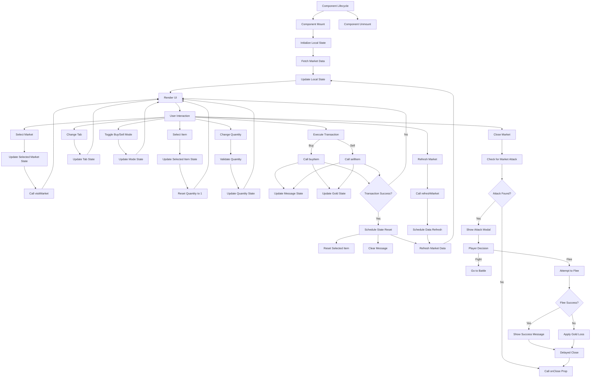

## Market Attack System

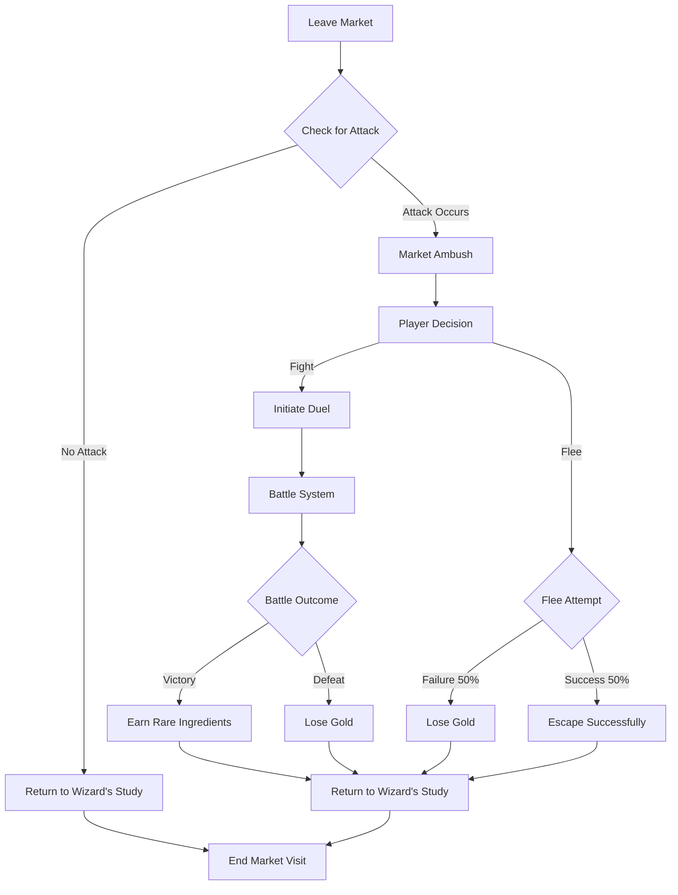

## Spell Progression Tech Tree System

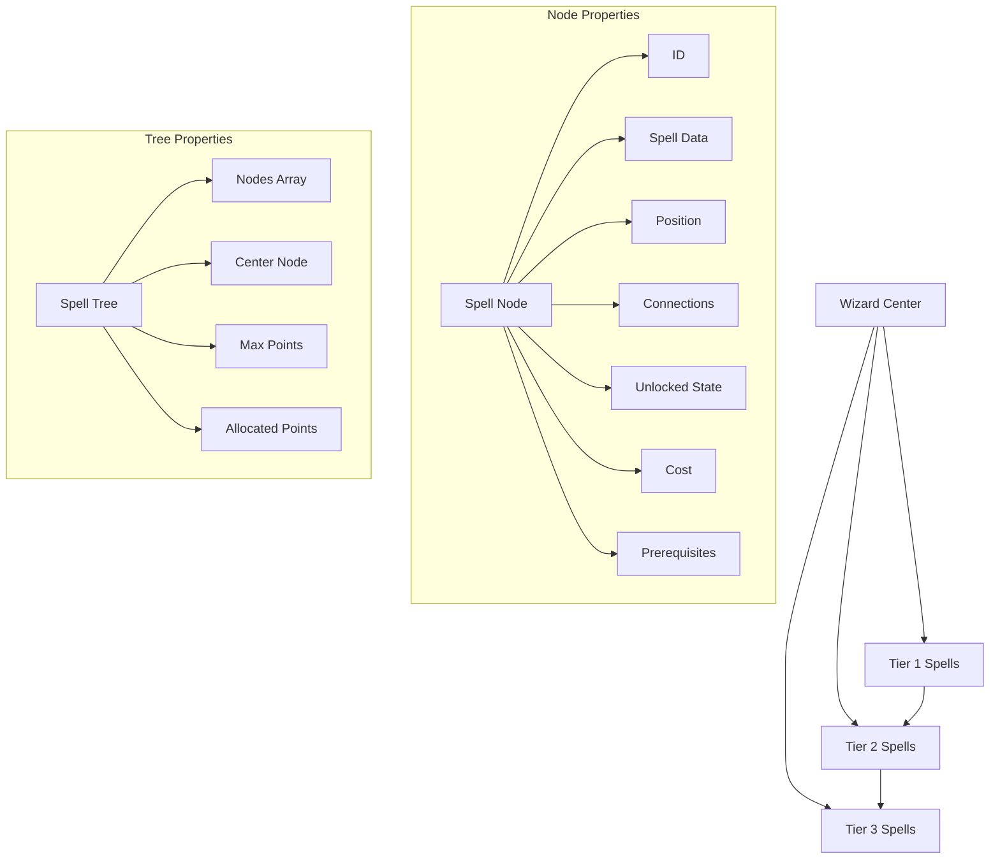

The spell progression tech tree system follows a Path of Exile-style design where:
1. The wizard is positioned at the center of the tree
2. Spells are organized in tiers radiating outward
3. Nodes are connected based on proximity and prerequisites
4. Each node has a cost based on its tier
5. Nodes can only be unlocked if:
   - The player has enough points
   - All prerequisites are met
   - The node is not already unlocked
6. The system includes:
   - Visual feedback for locked/unlocked states
   - Tooltips showing prerequisites and costs
   - Unlocking animations
   - Save/load functionality
   - Reset capability

## Inventory System Workflow

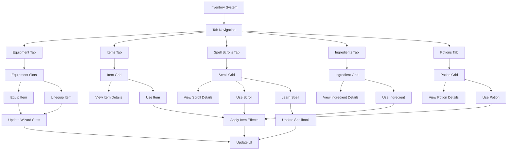

## Player Profile System

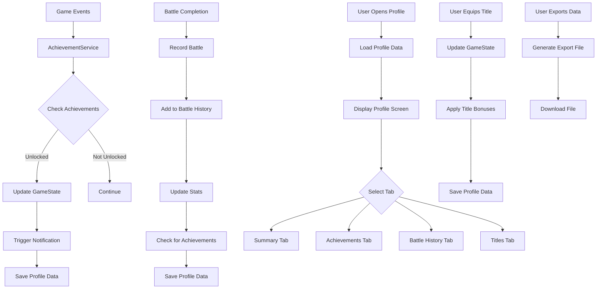

### Profile System Data Flow

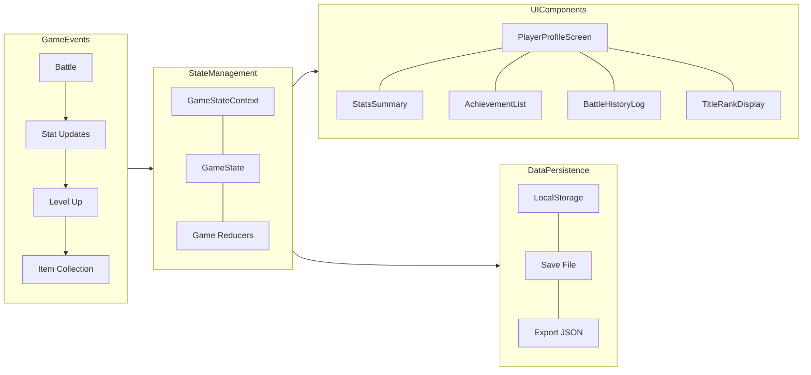

### Achievement Unlock Process

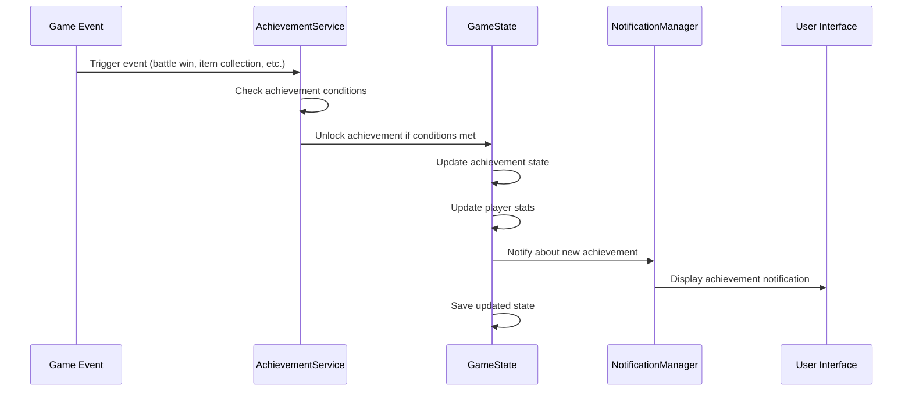

## Player Profile UI Navigation

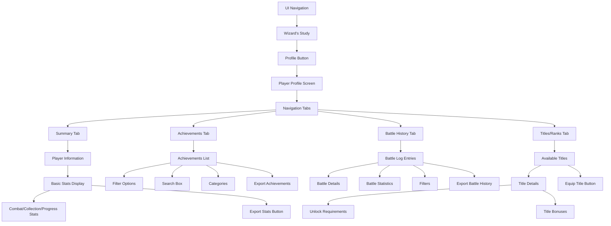

## Market UI Workflow

## Item and Scroll Generation Workflow

```mermaid
flowchart TD
    subgraph Equipment Generation
        E1[Player Level] --> E2[Equipment Generator]
        E2 --> E3[Procedural Equipment (Robes, Belts, etc.)]
    end

    subgraph Spell Scroll Generation
        S1[Loaded Spells]
        S2[Random Selection & Tier/Rarity Logic]
        S1 --> S2
        S2 --> S3[Spell Scroll Generator]
        S3 --> S4[Spell Scrolls (from Spells)]
    end

    E3 -.->|Not used for scrolls| S4
    S4 -.->|Not equipment| E3
```

## Equipment Slot Handling Process

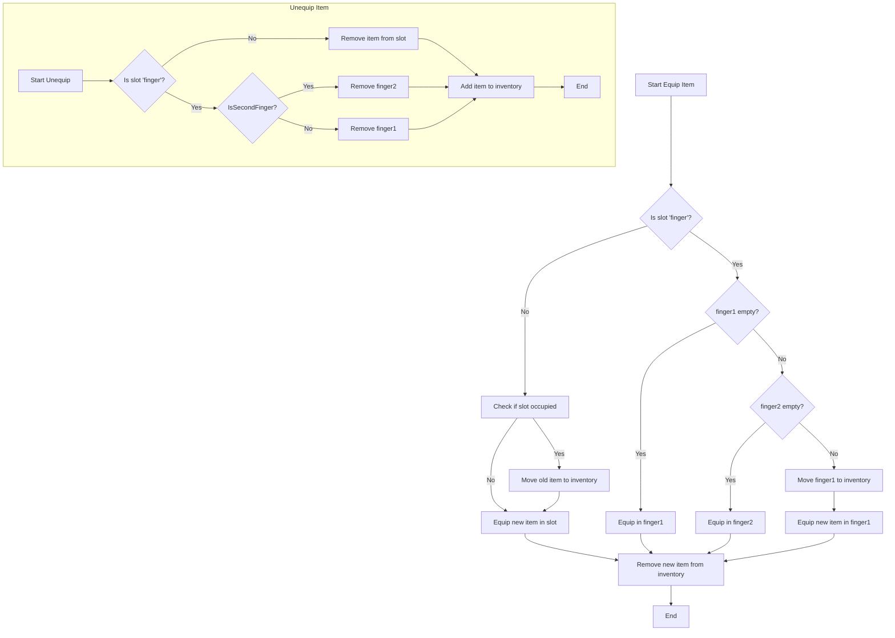

## Save Slot Deletion (Per-Slot)

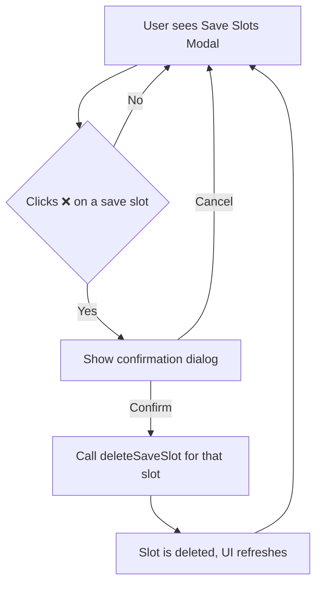

## Stat Calculation and Progression

```mermaid
flowchart TD
    Start[Wizard Created or Loaded]
    Start --> BaseStats[baseMaxHealth/baseMaxMana]
    Start --> ProgressionStats[progressionMaxHealth/progressionMaxMana]
    Start --> EquipmentStats[equipmentMaxHealth/equipmentMaxMana]
    
    ProgressionStats <-- LevelUpPoints[Level-Up Points Spent]
    EquipmentStats <-- EquipChange[Equipment Equipped/Unequipped]
    
    BaseStats --> TotalStats[totalMaxHealth/totalMaxMana]
    ProgressionStats --> TotalStats
    EquipmentStats --> TotalStats
    
    TotalStats --> UI[Display in UI/Combat]
```

- **baseMaxHealth/baseMaxMana**: Only changed by rare effects or admin tools
- **progressionMaxHealth/progressionMaxMana**: Increased by level-up points and permanent upgrades
- **equipmentMaxHealth/equipmentMaxMana**: Sum of all currently equipped item bonuses
- **totalMaxHealth/totalMaxMana**: Used for display and combat; sum of all above

### Attribute Upgrade Flow

```mermaid
flowchart TD
    Gain[Gain Level-Up Points] --> Open[Open Attribute Upgrade Screen]
    Open --> Choose[Choose Attribute]
    Choose --> Confirm[Spend Points]
    Confirm --> Update[Update Attribute Value]
    Update --> Recalc[Recalculate Stats]
    Recalc --> Save[Persist to Save Slot]
```

The attribute screen allows players to convert level-up points into permanent
stat increases that update the wizard's saved data.

### Equipment System (updated)

```mermaid
flowchart TD
    Start[Equipment System] --> Slots[Equipment Slots]
    Slots --> Head[Head: Wizard Hats]
    Slots --> Hand[Hand: Wands/Staffs/Spellbooks]
    Slots --> Body[Body: Robes]
    Slots --> Neck[Neck: Amulets]
    Slots --> Fingers[Fingers: Rings x2]
    Slots --> Belt[Belt: Potions]
    
    Head --> StatBoosts[Stat Boosts]
    Hand --> SpellEnhancement[Spell Enhancement]
    Body --> DefenseBoosts[Defense Boosts]
    Neck --> SpecialAbilities[Special Abilities]
    Fingers --> PassiveEffects[Passive Effects]
    Belt --> PotionStorage[Potion Storage]
    
    StatBoosts --> EquipmentStats[Sum to equipmentMaxHealth/equipmentMaxMana]
    SpellEnhancement --> EquipmentStats
    DefenseBoosts --> EquipmentStats
    SpecialAbilities --> EquipmentStats
    PassiveEffects --> EquipmentStats
    PotionStorage --> UsePotions[Use in Combat]
    
    EquipmentStats --> TotalStats[totalMaxHealth/totalMaxMana]
    TotalStats --> CombatCalculation[Combat Calculations]
    UsePotions --> CombatCalculation
```

## Spell Data Workflow

```mermaid
flowchart TD
    Start[Spell Creation/Editing] --> Validate[Validate XML Schema]
    Validate --> |Valid| SaveXML[Save to /public/data/spell_data.xml]
    Validate --> |Invalid| Error[Show Validation Error]
    SaveXML --> ClearCache[Clear Spell Cache]
    ClearCache --> AssignList[Assign List Membership]
    AssignList --> |archetype| ArchetypeList[Add to Archetype Spell List]
    AssignList --> |creature| CreatureList[Add to Creature Spell List]
    AssignList --> |any| DefaultList[Add to Default Spell List]
    ArchetypeList --> LoadGame[Load Spells at Runtime]
    CreatureList --> LoadGame
    DefaultList --> LoadGame
    LoadGame --> GameUse[Spells Usable in Game]
    Error --> Edit[Edit Spell Data]
    Edit --> Validate
```

- After saving spell data, the spell cache must be cleared using `clearSpellCache` to ensure the game reloads the latest XML.

- The spell data XML file is always located at `/public/data/spell_data.xml` in the project.
- At runtime, it is loaded from `/data/spell_data.xml` (the URL path).
- There is only one file; the `/public` directory is served as the web root.

## Model Loader Workflow

```mermaid
flowchart TD
    Start[Request Model] --> CheckCache{Cached?}
    CheckCache -- Yes --> Clone[Clone Cached]
    CheckCache -- No --> Load[Load From Path]
    Load --> Normalize[Apply Descriptor]
    Normalize --> Cache[Store in Cache]
    Cache --> Clone
    Clone --> Return[Return Scene]
```
