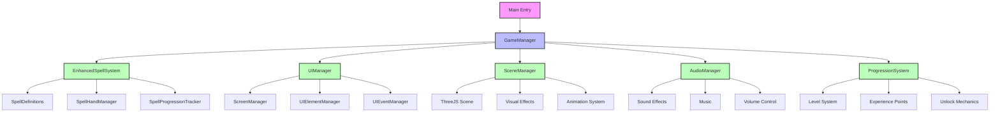
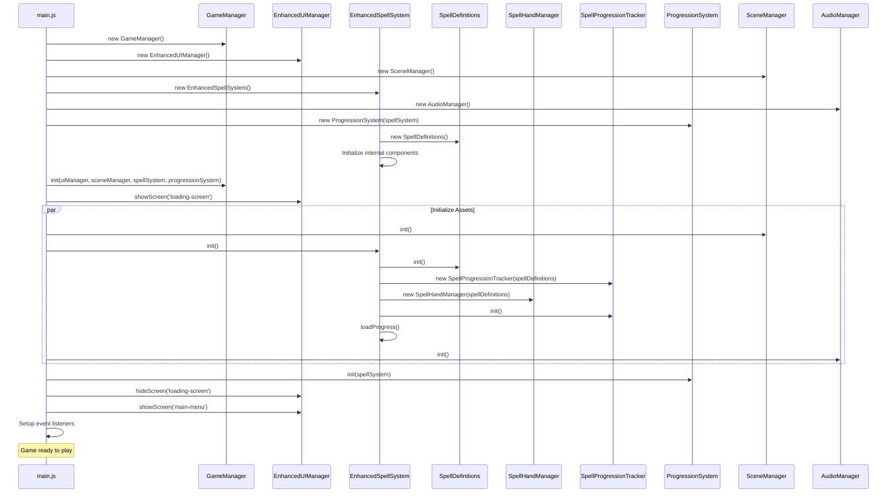
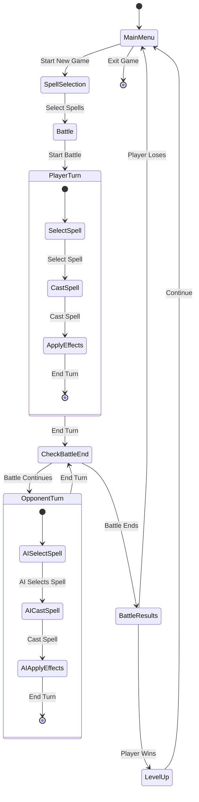
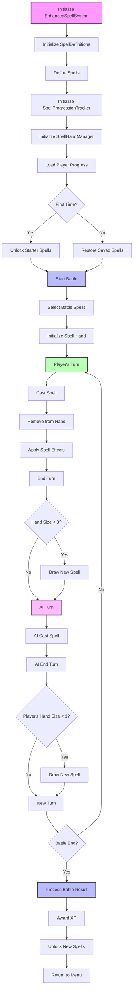
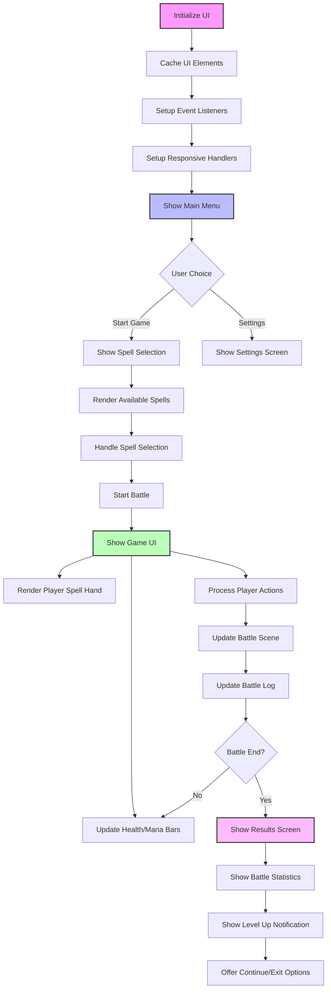
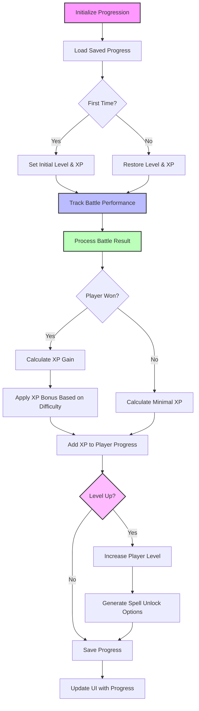
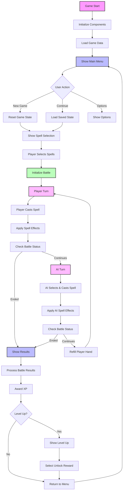

# Wizard's Choice - Process Maps

This document contains process maps for the Wizard's Choice game, visualizing the main components, interactions, and game flow.

## Component Structure



## Game Initialization Process



## Game Loop Process



## Spell System Process



## UI System Process



## Progression System Process



## Integrated Game Flow



## Potential Refactoring Targets

```mermaid
graph TD
    A[Completed Refactoring] --> B[Removed src/js/* duplication]
    A --> C[Modularized GameManager]
    A --> D[Modularized EnhancedSpellSystem]
    A --> E[Modularized UIManager]
    
    F[Remaining Code Improvements] --> G[Unused functions and variables]
    F --> H[Commented-out code]
    F --> I[Duplicate logic across components]
    F --> J[Large functions to break down]
    
    K[Performance Optimizations] --> L[ThreeJS rendering]
    K --> M[Asset preloading]
    K --> N[Spell effect animations]
    K --> O[Memory management]
    
    P[Documentation Updates] --> Q[Code documentation]
    P --> R[JSDoc comments]
    P --> S[User guide improvements]
    P --> T[Developer documentation]
    
    style A fill:#9f9,stroke:#333,stroke-width:2px
    style F fill:#f99,stroke:#333,stroke-width:2px
    style K fill:#f99,stroke:#333,stroke-width:2px
    style P fill:#f99,stroke:#333,stroke-width:2px
```



## Completed Refactoring Structure

```mermaid
graph TD
    A[Main Entry] --> B[GameStateManager]
    B --> C[BattleManager]
    B --> D[PlayerManager]
    
    E[EnhancedSpellSystem] --> F[SpellDefinitions]
    E --> G[SpellHandManager]
    E --> H[SpellProgressionTracker]
    
    I[EnhancedUIManager] --> J[ScreenManager]
    I --> K[UIElementManager]
    I --> L[UIEventManager]
    
    B --> E
    B --> I
    B --> M[SceneManager]
    B --> N[AudioManager]
    B --> O[ProgressionSystem]
    
    style A fill:#f9f,stroke:#333,stroke-width:2px
    style B fill:#bbf,stroke:#333,stroke-width:2px
    style C fill:#bfb,stroke:#333,stroke-width:2px
    style D fill:#bfb,stroke:#333,stroke-width:2px
    style E fill:#fbf,stroke:#333,stroke-width:2px
    style F fill:#dfd,stroke:#333,stroke-width:2px
    style G fill:#dfd,stroke:#333,stroke-width:2px
    style H fill:#dfd,stroke:#333,stroke-width:2px
    style I fill:#fbb,stroke:#333,stroke-width:2px
    style J fill:#fdd,stroke:#333,stroke-width:2px
    style K fill:#fdd,stroke:#333,stroke-width:2px
    style L fill:#fdd,stroke:#333,stroke-width:2px
