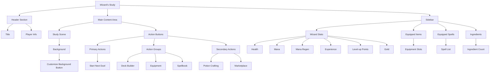
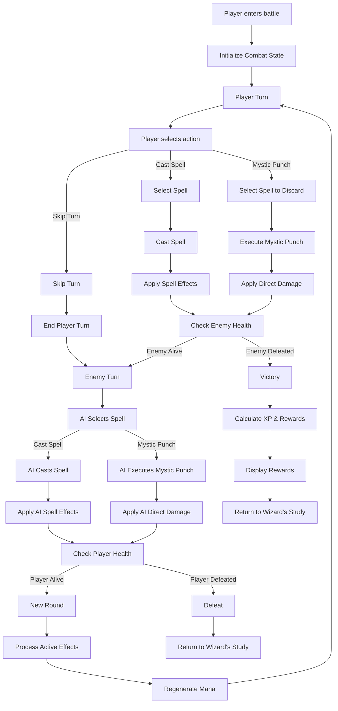
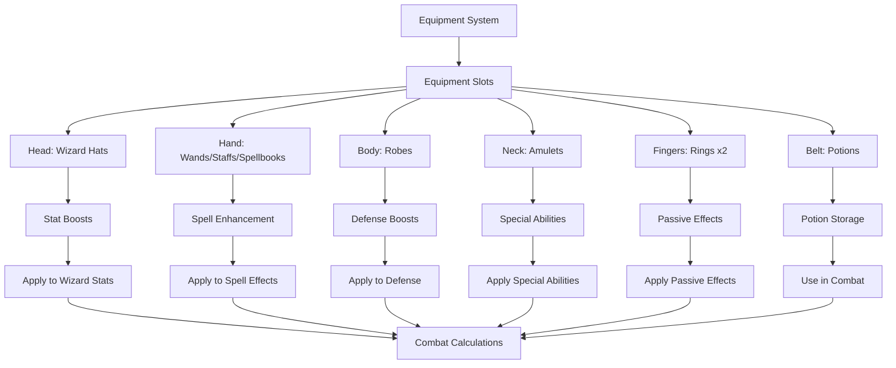
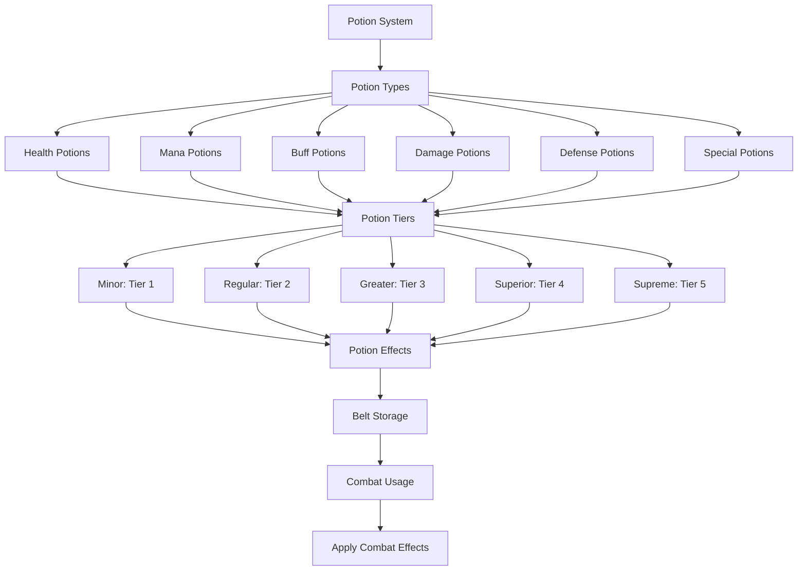
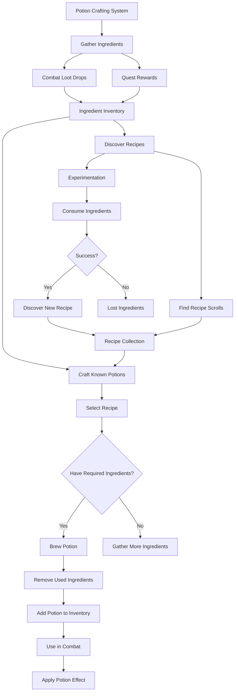
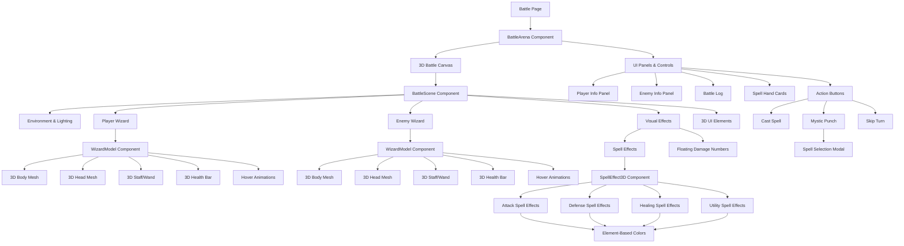
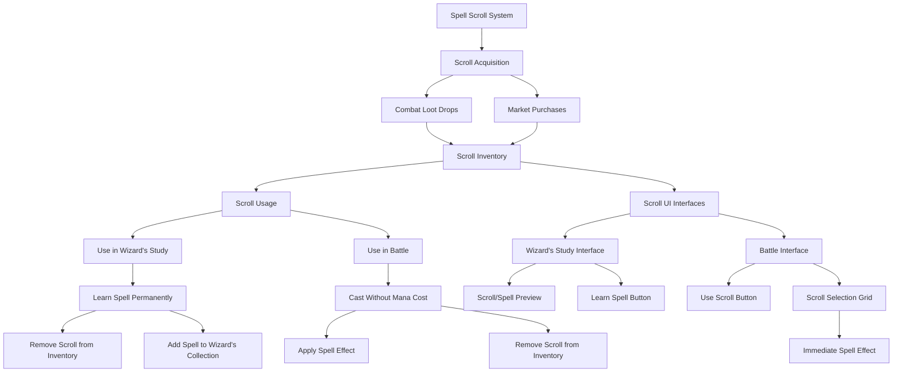
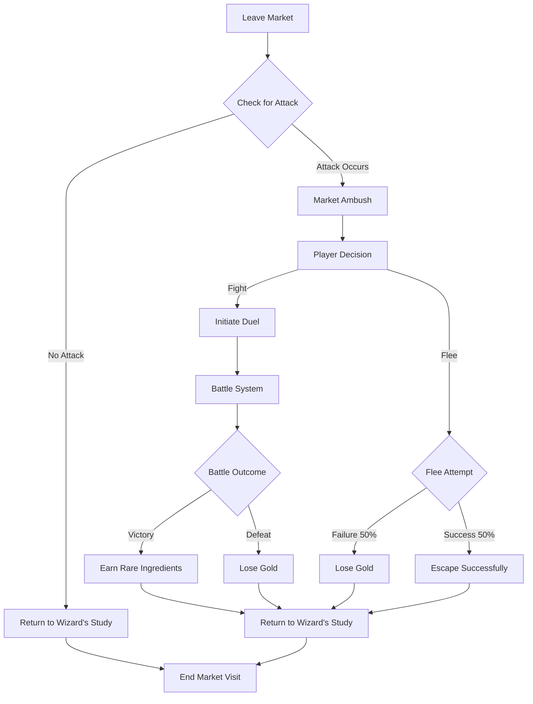
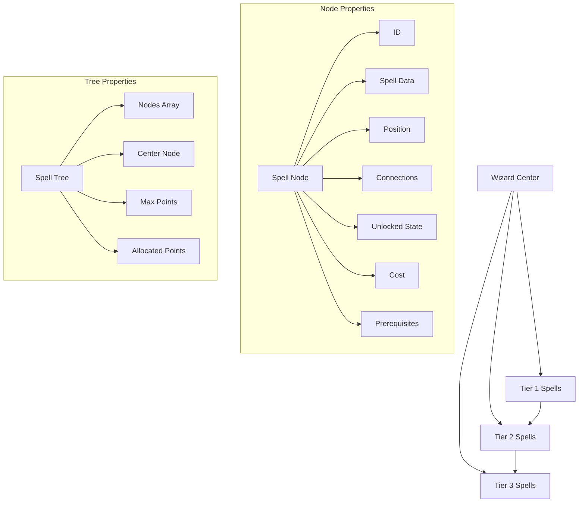
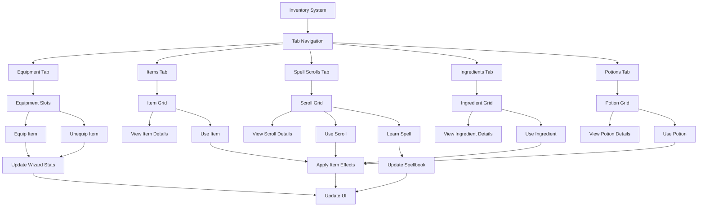

# Process Maps

## Wizard's Study UI Layout



## Battle System Workflow



## Equipment System



## Potion System



## Potion Crafting System



## 3D Battle Screen Components



## Spell Scroll System



## Market System

```mermaid
flowchart TD
    Start[Market System] --> Locations[Market Locations]
    Locations --> NoviceBazaar[Novice Bazaar]
    Locations --> HerbalistHaven[Herbalist's Haven]
    Locations --> ArcaneEmporium[Arcane Emporium]
    Locations --> AlchemistSquare[Alchemist's Square]
    Locations --> SpellcasterExchange[Spellcaster's Exchange]
    Locations --> EtherealBazaar[Ethereal Bazaar]
    Locations --> EnchantersWorkshop[Enchanter's Workshop]
    Locations --> CelestialApothecary[Celestial Apothecary]
    Locations --> ArchmageRepository[Archmage's Repository]
    Locations --> ElementalNexus[Elemental Nexus]
    Locations --> TemporalAuctionHouse[Temporal Auction House]
    Locations --> PhilosophersEmporium[Philosopher's Emporium]
    Locations --> CosmicLibrary[Cosmic Library]
    
    NoviceBazaar --> Level1[Level 1 Unlock]
    HerbalistHaven --> Level5[Level 5 Unlock]
    ArcaneEmporium --> Level10[Level 10 Unlock]
    AlchemistSquare --> Level15[Level 15 Unlock]
    SpellcasterExchange --> Level20[Level 20 Unlock]
    EtherealBazaar --> Level25[Level 25 Unlock]
    EnchantersWorkshop --> Level50[Level 50 Unlock]
    CelestialApothecary --> Level75[Level 75 Unlock]
    ArchmageRepository --> Level100[Level 100 Unlock]
    ElementalNexus --> Level150[Level 150 Unlock]
    TemporalAuctionHouse --> Level250[Level 250 Unlock]
    PhilosophersEmporium --> Level500[Level 500 Unlock]
    CosmicLibrary --> Level1000[Level 1000 Unlock]
    
    Locations --> MarketInventory[Market Inventory]
    MarketInventory --> Ingredients[Ingredients Stock]
    MarketInventory --> Potions[Potions Stock]
    MarketInventory --> Equipment[Equipment Stock]
    MarketInventory --> Scrolls[Spell Scrolls]
    
    MarketInventory --> PriceFluctuation[Price Fluctuations]
    PriceFluctuation --> Supply[Supply Levels]
    PriceFluctuation --> Demand[Demand Levels]
    
    Supply --> SupplyAffectsPrice[Supply Affects Price]
    Demand --> DemandAffectsPrice[Demand Affects Price]
    
    MarketInventory --> RefreshCycle[Inventory Refresh Cycle]
    RefreshCycle --> NormalRefresh[Regular Time Interval]
    RefreshCycle --> ManualRefresh[Player-Triggered Refresh]
    
    Start --> PlayerInteractions[Player Interactions]
    PlayerInteractions --> Buying[Buy Items]
    PlayerInteractions --> Selling[Sell Items]
    
    Buying --> TransactionBuy[Transaction Recorded]
    Selling --> TransactionSell[Transaction Recorded]
    
    TransactionBuy --> GoldDeducted[Gold Deducted]
    TransactionBuy --> InventoryUpdated[Item Added to Inventory]
    TransactionBuy --> MarketStockReduced[Market Stock Reduced]
    
    TransactionSell --> GoldAdded[Gold Added]
    TransactionSell --> InventoryRemoved[Item Removed from Inventory]
    
    Start --> Reputation[Market Reputation]
    Reputation --> ReputationEffects[Affects Prices]
    ReputationEffects --> BetterDeals[Higher Reputation = Better Deals]

    Start --> MarketAttacks[Market Attack System]
    MarketAttacks --> AttackChance[Attack Chance When Leaving]
    AttackChance --> MarketLevel[Based on Market Level]
    AttackChance --> GameDifficulty[Modified by Game Difficulty]
    
    MarketAttacks --> PlayerChoice[Player Choice]
    PlayerChoice --> Fight[Fight Attacker]
    PlayerChoice --> Flee[Attempt to Flee]
    
    Fight --> CombatResult{Combat Result}
    CombatResult --> |Victory| RareRewards[Earn Rare Ingredients]
    CombatResult --> |Defeat| GoldPenalty[Lose Gold]
    
    Flee --> FleeResult{Flee Success?}
    FleeResult --> |Yes (50%)| SafeReturn[Return to Study]
    FleeResult --> |No (50%)| GoldLoss[Lose Gold]
```

## Market Attack System



## Spell Progression Tech Tree System



The spell progression tech tree system follows a Path of Exile-style design where:
1. The wizard is positioned at the center of the tree
2. Spells are organized in tiers radiating outward
3. Nodes are connected based on proximity and prerequisites
4. Each node has a cost based on its tier
5. Nodes can only be unlocked if:
   - The player has enough points
   - All prerequisites are met
   - The node is not already unlocked
6. The system includes:
   - Visual feedback for locked/unlocked states
   - Tooltips showing prerequisites and costs
   - Unlocking animations
   - Save/load functionality
   - Reset capability

## Inventory System Workflow

